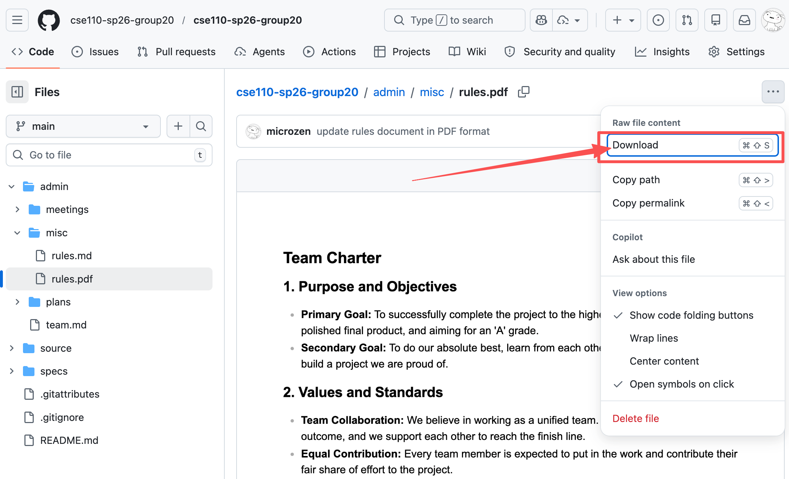
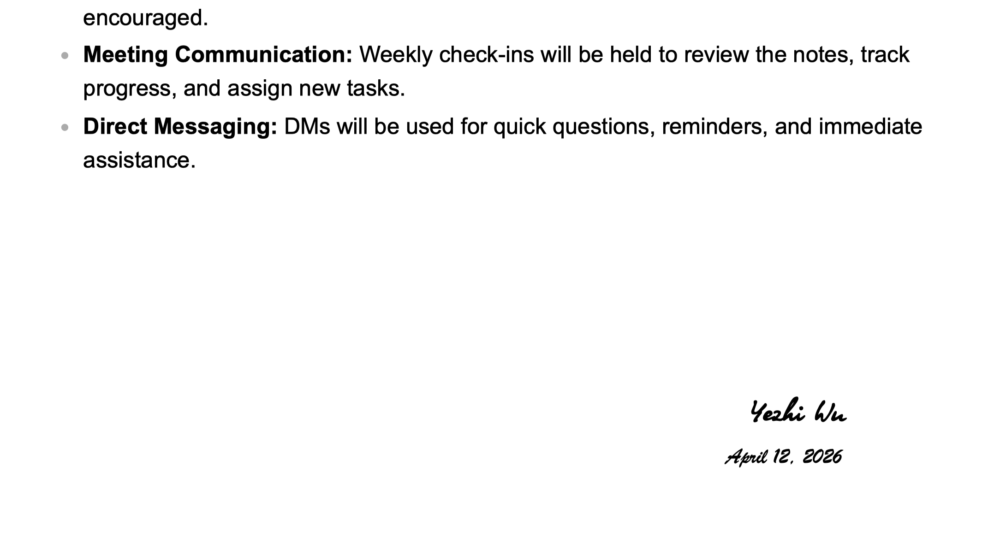
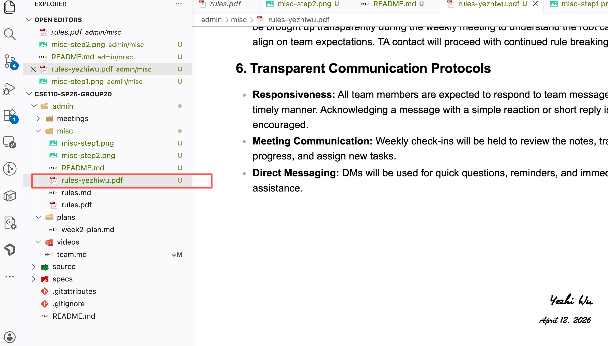
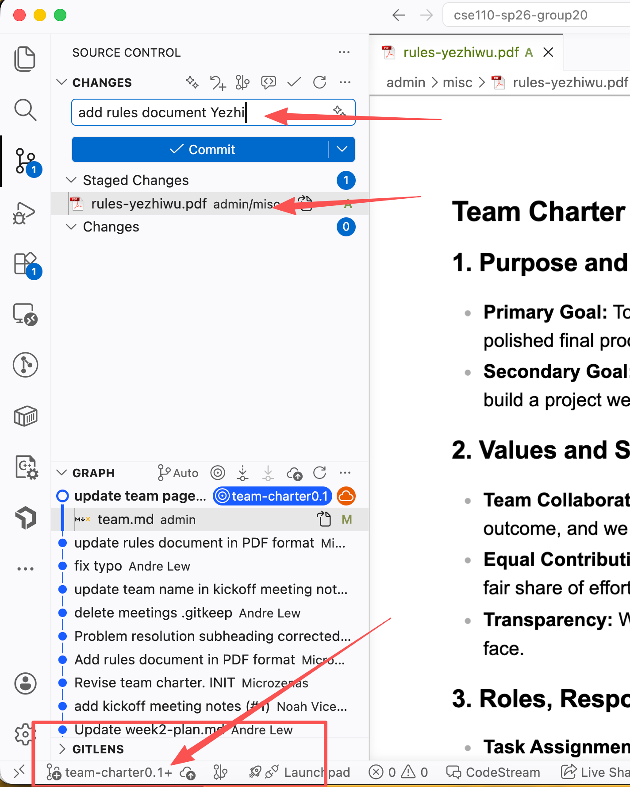

# Team Charter Instructions

1). [Download](https://github.com/cse110-sp26-group20/cse110-sp26-group20/blob/main/admin/misc/rules.pdf) it. 

2). Put your name on the Charter.

3). Include your file to github. `rules-[first name][last name].pdf`

4). Submit and push it to branch `team-charter0.1`

