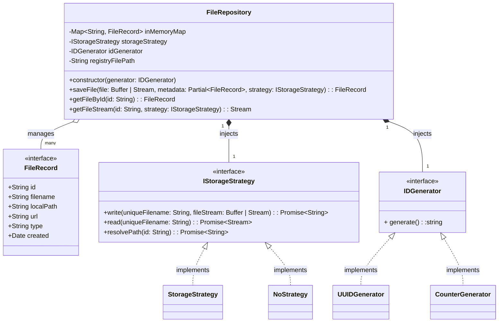

# Design Rationale

In a lightweight project without a database, we need to unify file management across multiple business flows (Template loading, File uploads, Editor reads). This design leverages Inversion of Control (IoC) and Dependency Injection (DI) to completely decouple the core "file record management logic" from "underlying side effects" (disk I/O and random ID generation).

## Core Module Responsibilities

- FileRepository: The core brain of the system. It strictly manages the In-Memory Map and the lifecycle of file objects. 
- IStorageStrategy (I/O Isolation): Handles the actual physical reading and writing of file streams. 
- IDGenerator: Centralizes the creation of unique identifiers, isolating the randomness of the underlying algorithms from the rest of the system.

## How Does This Fit for the Team?
### Testability
- Eliminate I/O Pollution: During testing, the team can inject an empty strategy, such as `NoStrategy`. This means no real disk reads/writes occur, no garbage files are generated on the hard drive, and test execution remains incredibly fast. 
- Parallel Development (Unblocking): Team members can build and test the FileRepository using NoStrategy without waiting for the actual disk I/O logic to be finalized. This allows frontend and backend integration to proceed simultaneously without blocking each other.
- Control Randomness: By injecting a predictable generator during tests (e.g., a CounterGenerator that returns "1", "2"), test code can make precise assertions like `expect(record.id).toBe('1')`. This allows developers to focus entirely on testing the actual implementation logic inside FileRepository.
