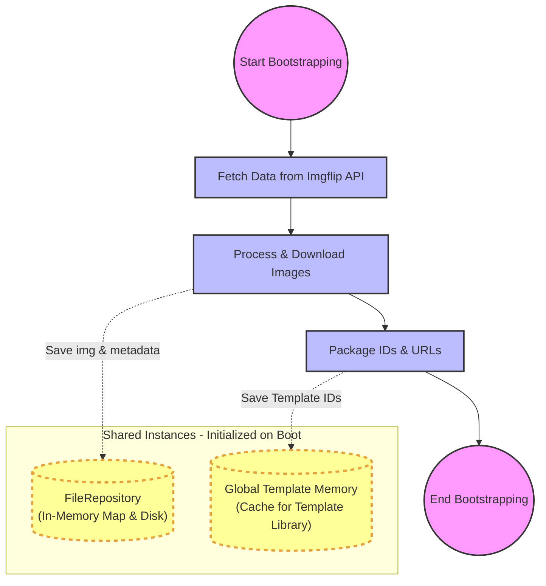
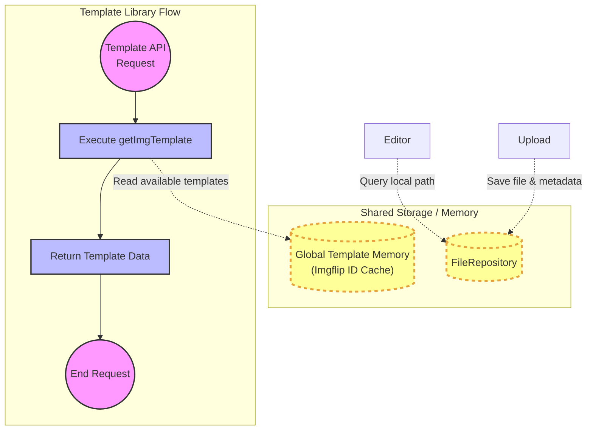
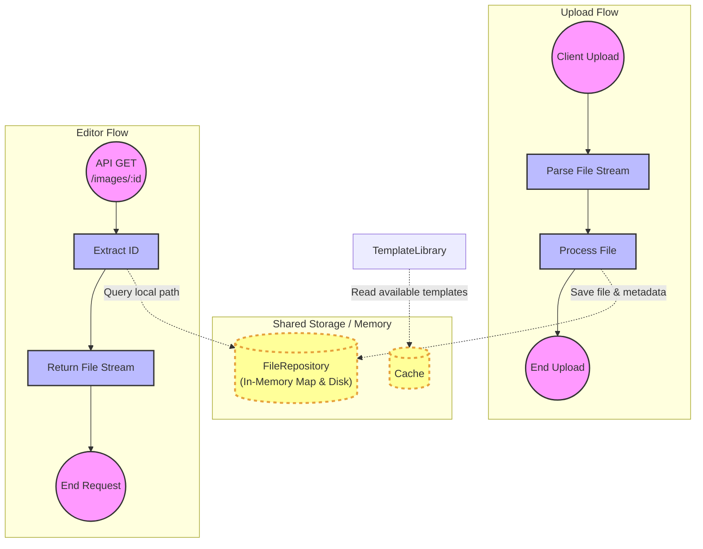

# File System
## Background
Given that the image feature involves multiple different pages and spans across various functions, it is necessary to implement a class design capable of handling `file upload`, `template library`, and `editor` to fulfill this requirement.

To address this problem, we could invoke a file system design with a `file ID`. Therefore, the file system can be effectively managed via IDs, as long as the uniqueness of each ID is ensured.

## Load Template at Startup
First, regarding the template library: due to concerns about API call limits and response times, I decided to **load the template images directly into memory** during project startup. Below is the BOOTSTRAP flowchart illustrating this process.

## Template Library
Since the data is **already loaded into memory** during program startup, the Template Library simply needs to read the corresponding information directly from memory and return it to the frontend.

## FileRepository
Similarly, file reading and writing operations are handled through the `FileRepository`. 

- During a **file upload**, the file must be serialized and then saved to the file system. 
- For the Editor feature, whether dealing with a template or an uploaded file, it simply uses the `file ID` to locate the corresponding file via the **FileRepository**. Note: *The editor functionality described here is designed exclusively for the **file system** and does NOT include the AI Generator component.*

